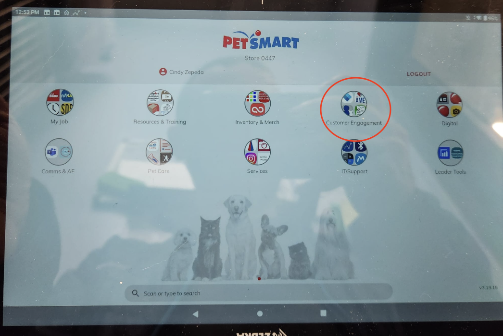
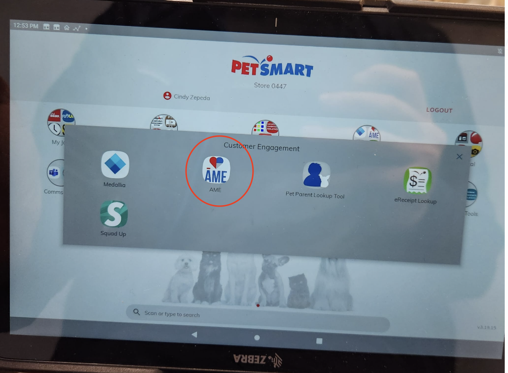
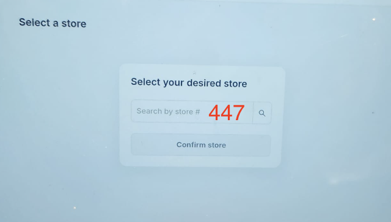
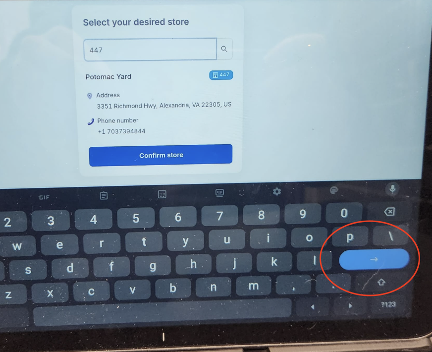
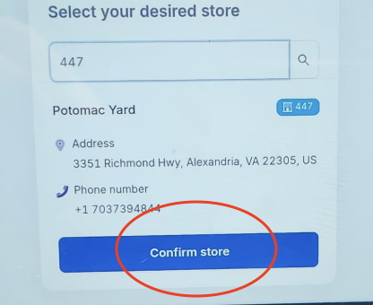
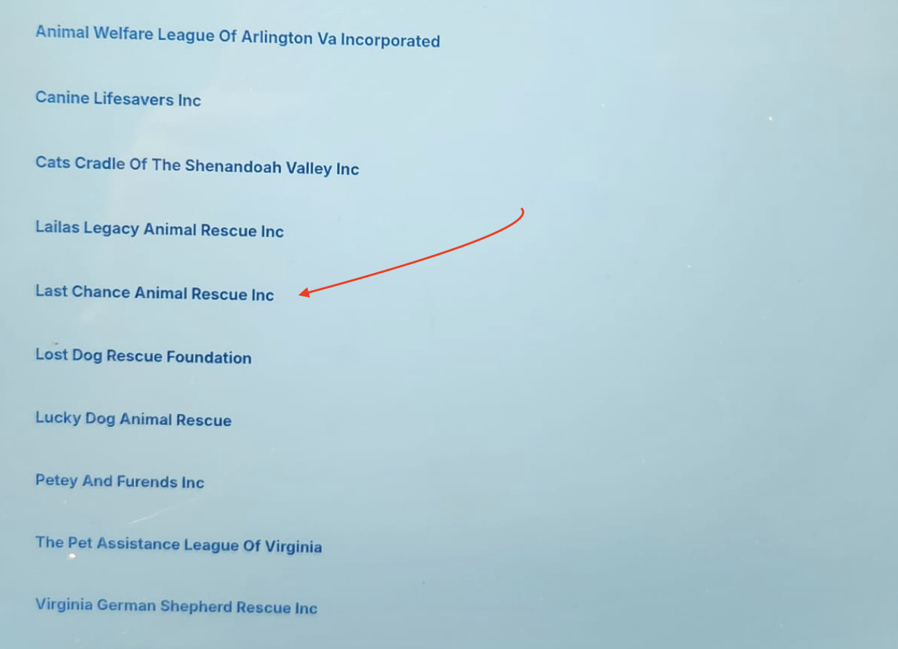

# Completing an Adoption

This guide provides step-by-step instructions for finalizing an adoption using the tablet system once an adopter has been approved and all paperwork is complete.

## Prerequisites

Before starting the adoption completion process, ensure:
- The adoption application has been approved
- The adoption fee has been collected (if paid by cash)
- The adoption contract has been signed
- All necessary paperwork is complete

## Step-by-Step Instructions

### 1. Access the Tablet and Select Last Chance

1.  Enter the password to unlock the device.
    *   *Note: The password is set by PetSmart staff. If you do not know it, please ask a PetSmart employee.*
2.  Tap "Customer Engagement".
    
3.  Select "AME" (Adoption Made Easy).
    
4.  Select store number **447**.
    
5.  Tap the blue confirmation button.
    
6.  Confirm the store selection when prompted.
    
7.  The initial pet list may be empty. Tap the "Home" button.
8.  Select "Last Chance" from the options.
    
9.  You should now see the list of available cats at Last Chance at PetSmart at Potomac Yards.

### 2. Find the Cat Being Adopted

1.  Find the cat being adopted by one of:
    - scrolling through the list of available cats. 
    - searching the ID in the search bar 
    - **Remark**: If the cat is not available, please add the cat to the system (See instructions # TODO add the instructions)
2.  Click on Process Adoption Button for the cat being adopted 
3.  Close the pop up 

<!-- 

### 3. Access the Adoption Process

1. From the cat's profile, tap the "Process Adoption" button
2. A new screen will appear to guide you through the adoption process

### 4. Select or Add Adopter

1. The system will prompt you to select an adopter
2. If the adopter is already in the system:
   - Tap "Select Existing Adopter"
   - Search for the adopter by name or email
   - Tap on the correct adopter from the search results
3. If the adopter is new to the system:
   - Tap "Add New Adopter"
   - Fill out the required fields:
     - Full name
     - Address
     - Phone number
     - Email address
   - Tap "Save Adopter" to continue

### 5. Verify Adoption Requirements

The system will display a checklist of adoption requirements. Mark each item as completed:

- □ Adoption application approved
- □ Adoption contract signed
- □ Adoption fee collected
   - Amount: $________
   - Payment method: □ Cash □ Credit Card □ Check □ Other: ________
- □ Medical records provided
- □ Adopter ID verified
- □ New collar/ID tag provided (if applicable)
- □ Starter kit provided (if applicable)

### 6. Complete the Adoption

1. Review all information for accuracy
2. Tap "Complete Adoption" button
3. A confirmation dialog will appear; tap "Confirm"
4. The system will update the cat's status to "Adopted"

## After Completing the Adoption

1. Provide the adopter with:
   - Copy of the signed adoption contract
   - Medical records
   - Microchip information
   - Care instructions
   - Adoption certificate (if generated)
   - Contact information for post-adoption support

2. Update any physical records or files
   - Move the cat's physical file to the "Adopted" section (if applicable)
   - Update any bulletin boards or displays

3. Send a welcome email through the system
   - From the adopted cat's profile, tap "Send Welcome Email"
   - Review the pre-filled template
   - Make any necessary adjustments
   - Tap "Send"

## Troubleshooting

- **System Freezes During Adoption Process**: Save progress if possible, close and reopen the app, then continue where you left off
- **Payment Processing Issues**: If the payment system is down, note the payment method in the comments and process manually later
- **Adopter Not Found in System**: Double-check spelling; if truly not in system, add as new adopter
- **Cannot Complete Adoption Due to Missing Requirements**: Note which requirements are missing and explain to the adopter what needs to be completed before proceeding

For technical issues that persist, contact the tech coordinator at [contact information].  -->